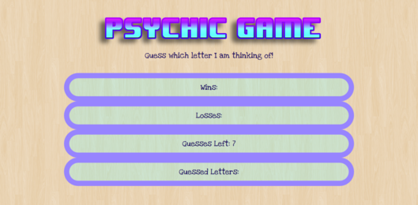

# Psychic-Game

## Contributors

kd101jp14

## Technology

* HTML5
* CSS3
* Bootstrap 4
* JavaScript

## Live demo:
https://kd101jp14.github.io/Psychic-Game/

## About

This repository consists of a guessing game called `Psychic-Game` and its components. The computer chooses a letter. The user guesses which letter the computer has chosen by pressing an alphabet key. The user may use up to 7 guesses per round. If the user guesses the letter correctly or runs out of guesses, the game automatically restarts. The game keeps track of wins, losses and letters guessed.

### The Challenge

This project was my first web application. The main challenge was getting from pseudo code to actual Javascript. This problem was overcome by taking it step by step and making sure that the psuedo code was broken down and detailed enough to make coding easier. To understand how to create the game logic, I referenced many different coding examples to learn when to push items into arrays and other vital concepts for this game.

## Screenshot

## License

* This project does not have a license and is not currently open for contributions. Suggestions are welcome.

## Contact

* Homepage:  https://github.com/kd101jp14

* E-mail: davis.kyra@rocketmail.com
